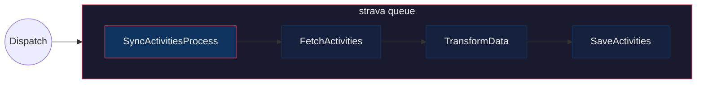
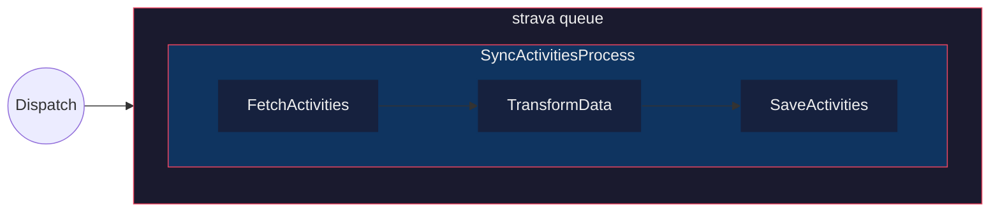
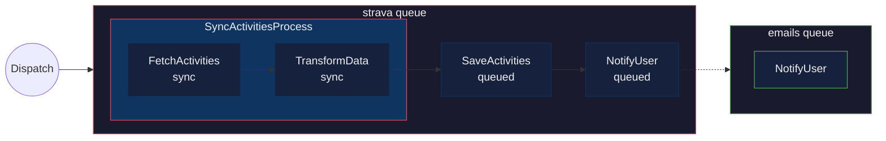

<p align="center">
    <a href="https://github.com/r2luna/brain/actions"></a>
    <a href="https://packagist.org/packages/r2luna/brain"></a>
    <a href="https://packagist.org/packages/r2luna/brain"></a>
    <a href="https://packagist.org/packages/r2luna/brain"></a>
</p>

---

**Brain** is an elegant Laravel Package that helps you organize your Laravel application using Domain-Driven Design principles through a simple command-line interface.

## Features

-   🎯 **Domain-Driven Structure**: Easily create new domains with proper architecture (optional)
-   🔄 **Process Management**: Generate process classes for complex business operations
-   🔍 **Query Objects**: Create dedicated query classes for database operations
-   ⚡ **Task Management**: Generate task classes for background jobs and queue operations
-   🔧 **Flexible Configuration**: Customize root directory, domain organization, and class naming conventions
-   📊 **Built-in Logging**: Track process and task execution with comprehensive event system

## Gains

-   ♻️ **Code Reusability**: By using tasks, you can easily reuse code across different processes, reducing duplication and enhancing maintainability.
-   🧩 **Clear Domain Understanding**: The structured approach provides a better understanding of each domain's processes, making it easier to manage and scale your application.
-   🔧 **Improved Maintainability**: With well-defined domains and processes, maintaining and updating your application becomes more straightforward and less error-prone.

## Installation

You can install the package via composer:

```bash
composer require r2luna/brain
```

## Configuration

Brain can be customized through environment variables or by publishing the configuration file:

```bash
php artisan vendor:publish --provider="Brain\BrainServiceProvider"
```

### Available Configuration Options

#### Root Directory
```bash
# .env
BRAIN_ROOT=Brain
```
Defines the main directory where processes, tasks, and queries are created. Default: `Brain`

#### Use Domains
```bash
# .env
BRAIN_USE_DOMAINS=false
```
Organizes code into domain-specific subdirectories. When enabled, creates structure like `app/Brain/Users/Processes`. Default: `false`

#### Use Suffix
```bash
# .env
BRAIN_USE_SUFFIX=false
```
Automatically appends suffixes to class names (e.g., `CreateUser` becomes `CreateUserProcess`). Default: `false`

#### Custom Suffixes
```bash
# .env
BRAIN_TASK_SUFFIX=Task
BRAIN_PROCESS_SUFFIX=Process
BRAIN_QUERY_SUFFIX=Query
```
Customize the suffixes used when `BRAIN_USE_SUFFIX=true`. Defaults: `Task`, `Process`, `Query`

#### Logging
```bash
# .env
BRAIN_LOG_ENABLED=false
```
Enables logging for all processes and tasks. See [Logging](#logging) section for details. Default: `false`

## Usage

### Creating a Process

```bash
php artisan make:process
... follow prompt
name: CreateUserProcess
domain: Users  # Only asked if BRAIN_USE_DOMAINS=true
```

This will create a new process class:
- With domains: `app/Brain/Users/Processes/CreateUserProcess.php`
- Without domains: `app/Brain/Processes/CreateUserProcess.php`

> [!IMPORTANT] 
> Note that every task running inside a process executes within a database transaction by default.

### Creating a Task

```bash
php artisan make:task
... follow prompt
name: SendWelcomeEmailTask
domain: Users  # Only asked if BRAIN_USE_DOMAINS=true
```

This will create a new task class:
- With domains: `app/Brain/Users/Tasks/SendWelcomeEmailTask.php`
- Without domains: `app/Brain/Tasks/SendWelcomeEmailTask.php`

#### Queuable Tasks

To send the task to the queue simply implements Laravel Contract `ShouldQueue` to the class

```php
<?php

namespace App\Brain\User;

use Brain\Task;
use Illuminate\Contracts\Queue\ShouldQueue;

class SendWelcomeNotifications extends Task implements ShouldQueue
{
    public function handle(): self
    {
        //

        return $this;
    }
}
```

#### Delay Queueable Tasks

Brain Tasks has a protected function called `runIn()` that you can use to determine when do you want to run the job if you need to delay.

```php
class SendWelcomeNotifications extends Task implements ShouldQueue
{
    protected function runIn(): int|Carbon|null
    {
        return now()->addDays(2);
    }
    ...
}
```

#### Setting a Specific Queue with `#[OnQueue]`

> [!WARNING]
> Do **not** declare `public string $queue = 'my-queue'` on a Task — this causes a PHP fatal error because Laravel's `Queueable` trait already declares `$queue` without a type hint.

Use the `#[OnQueue('queue-name')]` attribute to assign a specific queue to a Task or Process:

```php
use Brain\Attributes\OnQueue;
use Brain\Task;
use Illuminate\Contracts\Queue\ShouldQueue;

#[OnQueue('emails')]
class SendWelcomeNotifications extends Task implements ShouldQueue
{
    public function handle(): self
    {
        // This task will run on the "emails" queue
        return $this;
    }
}
```

When applied to a **Process**, the attribute does two things:

1. The Process itself is dispatched to that queue (if it implements `ShouldQueue`)
2. All queued child tasks **inherit** the Process queue — unless the task defines its own `#[OnQueue]`

```php
use Brain\Attributes\OnQueue;
use Brain\Process;
use Illuminate\Contracts\Queue\ShouldQueue;

#[OnQueue('strava')]
class SyncActivitiesProcess extends Process implements ShouldQueue
{
    protected array $tasks = [
        FetchActivities::class,      // ShouldQueue → runs on "strava" (inherited)
        SaveActivities::class,       // sync task   → unaffected
        NotifyUser::class,           // has #[OnQueue('emails')] → runs on "emails" (own queue wins)
    ];
}
```

#### Queue Execution Flows

Below are the three most common queue configurations.

**1. Process + all Tasks on the same queue**

The process and every queued task run on `strava`:



```php
#[OnQueue('strava')]
class SyncActivitiesProcess extends Process implements ShouldQueue
{
    protected array $tasks = [
        FetchActivities::class,    // implements ShouldQueue
        TransformData::class,      // implements ShouldQueue
        SaveActivities::class,     // implements ShouldQueue
    ];
}
```

**2. Process on a queue, Tasks run synchronously inside it**

The process is queued, but internally its tasks run one after another in the same job:



```php
#[OnQueue('strava')]
class SyncActivitiesProcess extends Process implements ShouldQueue
{
    protected array $tasks = [
        FetchActivities::class,    // sync (no ShouldQueue)
        TransformData::class,      // sync
        SaveActivities::class,     // sync
    ];
}
```

**3. Process on a queue, mixed sync and queued Tasks**

The process is queued. Some tasks run synchronously inside the process job, others are dispatched to their own queue jobs:



```php
#[OnQueue('strava')]
class SyncActivitiesProcess extends Process implements ShouldQueue
{
    protected array $tasks = [
        FetchActivities::class,    // sync — runs inside the process job
        TransformData::class,      // sync — runs inside the process job
        SaveActivities::class,     // implements ShouldQueue → dispatched to "strava"
        NotifyUser::class,         // implements ShouldQueue + #[OnQueue('emails')] → dispatched to "emails"
    ];
}
```

> [!TIP]
> A task's own `#[OnQueue]` always takes precedence over the Process-level queue.

#### Conditional Run Tasks in a Process

You can use a protected function `runIf()` to conditionally run a task.

```php
/**
 * @property-read int $amount
 */
class SendWelcomeNotifications extends Task
{
    protected function runIf(): bool
    {
        return $this->amount > 200;
    }
    ...
}
```

#### Validating Task Properties

You can validate the properties passed to a task by defining a `rules()` method that returns an array of validation rules.

```php
/**
 * @property-read User $user
 * @property string $message
 */
class SendWelcomeNotifications extends Task
{
    public function rules(): array
    {
        return [
            'user' => 'required',
            'message' => 'required|string|max:255',
        ];
    }

    public function handle(): self
    {
        // ...

        return $this;
    }
    ...
}
```

Rules will validate based on the payload that was passed to the task when it was dispatched, and will override the default validation based on the docblock @property-read annotations.

#### Task helper methods 

-   `toArray()`: Returns the task properties as an array. Ex. `['user' => $this->user]`

#### Cancel the Process

If you need, for any reason, cancel the process from inside a task. You can call `cancelProcess()` method to do it.

```php
class AddRoles extends Task
{
    public function handle(): self
    {
        if($anyReason) {
            $this->cancelProcess();
        }

        return $this;
    }
}
```

> [!CAUTION]
> This will not work if the task is setup to run in a queue.

#### Sensitive Properties with `#[Sensitive]`

Use the `#[Sensitive('key1', 'key2')]` attribute to mark payload properties that should be automatically redacted in logs, JSON serialization, and debug output. Sensitive values are wrapped in `SensitiveValue` — they remain accessible inside your task via `$this->key`, but are replaced with `**********` everywhere else.

```php
use Brain\Attributes\Sensitive;
use Brain\Task;

/**
 * @property-read string $email
 * @property string $password
 * @property string $credit_card
 */
#[Sensitive('password', 'credit_card')]
class CreateUser extends Task
{
    public function handle(): self
    {
        // $this->password returns the real value
        // but logs, JSON, and debug output show "**********"
        return $this;
    }
}
```

**Process-level inheritance:** When `#[Sensitive]` is applied to a Process, all child tasks automatically inherit the sensitive keys — even if the tasks themselves don't declare the attribute. Task-level and process-level keys are merged and deduplicated.

```php
use Brain\Attributes\Sensitive;
use Brain\Process;

#[Sensitive('password', 'credit_card')]
class CreateUserProcess extends Process
{
    protected array $tasks = [
        ValidateInput::class,     // password & credit_card are sensitive here
        ChargeCustomer::class,    // password & credit_card are sensitive here too
        SendConfirmation::class,
    ];
}
```

> [!TIP]
> The `brain:show -vv` command displays a `[sensitive]` indicator next to sensitive properties.

### Creating a Query

```bash
php artisan make:query
... follow prompt
name: GetUserByEmailQuery
domain: Users  # Only asked if BRAIN_USE_DOMAINS=true
model: User
```

This will create a new query class:
- With domains: `app/Brain/Users/Queries/GetUserByEmailQuery.php`
- Without domains: `app/Brain/Queries/GetUserByEmailQuery.php`

## Example Usage

```php
// Using a Query
$user = GetUserByEmailQuery::run('john@example.com');

// Setting up a Process
class CreateUserProcess extends Process
{
    protected array $tasks = [
        RegisterUserTask::class,
        SendWelcomeEmailTask::class, // Async task
        NotifyStaffTask::class, // Async task
        SubProcess::class
    ];
}

// Using a Process
CreateUserProcess::dispatch([
    'name' => 'John Doe',
    'email' => 'john@example.com'
]);

// Using a Task without a process
SendWelcomeEmailTask::dispatch([
    'user' => $user
]);
```

## Visualizing Your Brain

Use the `brain:show` command to visualize your entire Brain structure in the terminal:

```bash
php artisan brain:show
```

```
  USERS
  ├── PROC  CreateUserProcess ·······························
  ├── TASK  SendWelcomeEmailTask ····························
  ├── TASK  NotifyStaffTask ································· queued
  └── QERY  GetUserByEmailQuery ·····························

  PAYMENTS
  ├── PROC  PaymentSucceededProcess ················· chained
  └── QERY  GetPaymentQuery ································
```

### Filtering by type

Use flags to show only specific types. Flags can be combined:

```bash
php artisan brain:show -p              # only processes
php artisan brain:show -t              # only tasks
php artisan brain:show -Q              # only queries
php artisan brain:show -p -t           # processes and tasks
```

### Filtering by name

Use `--filter` to search by class name (case-insensitive):

```bash
php artisan brain:show --filter=User   # anything with "User" in the name
php artisan brain:show -p --filter=Payment  # processes matching "Payment"
```

When combining `-p` with `--filter`, if the filter matches a sub-task name, the parent process is shown with only the matching sub-tasks. If it matches a process name, all its sub-tasks are shown automatically.

### Verbosity levels

```bash
php artisan brain:show -v              # show sub-tasks inside processes
php artisan brain:show -vv             # also show task properties (input/output)
```

```
  USERS
  ├── PROC  PaymentSucceededProcess ················· chained
  │         ├── 1. T SavePaymentTask ················ queued
  │         └── 2. T InviteUserTask ·························
  ├── TASK  CreateCommentTask ·······························
  │            → user_id: int
  │            ← comment: \Comment|null
  └── QERY  ExampleQuery ···································
```

- `→` input property (`@property-read`)
- `←` output property (`@property`)

## Architecture

Brain helps you organize your code into three main concepts:

-   **Processes**: Complex business operations that might involve multiple steps
-   **Queries**: Database queries and data retrieval operations
-   **Tasks**: Sync/Async operations that can be called as part of a process or not

Each concept is organized within its respective domain, promoting clean architecture and separation of concerns.

## Logging

Brain provides built-in logging functionality to track the execution and outcomes of processes and tasks. By default, logging is disabled but can be enabled through configuration.

### Configuration

To enable logging, set the `BRAIN_LOG_ENABLED` environment variable or update the config file:

```bash
# .env
BRAIN_LOG_ENABLED=true
```

Or publish and modify the configuration file:

```bash
php artisan vendor:publish --provider="Brain\BrainServiceProvider"
```

Then update `config/brain.php`:

```php
'log' => env('BRAIN_LOG_ENABLED', true),
```

### Events

Brain dispatches events throughout the lifecycle of processes and tasks. These events can be used for logging, monitoring, or triggering additional actions.

#### Process Events

-   **`Brain\Processes\Events\Processing`** - Dispatched when a process starts executing
-   **`Brain\Processes\Events\Processed`** - Dispatched when a process completes successfully
-   **`Brain\Processes\Events\Error`** - Dispatched when a process encounters an error

Each event contains:
-   `process` (string): The process class name
-   `runProcessId` (string): A unique ID for this execution
-   `payload` (array|object): The data passed to the process
-   `meta` (array): Additional metadata

#### Task Events

-   **`Brain\Tasks\Events\Processing`** - Dispatched when a task starts executing
-   **`Brain\Tasks\Events\Processed`** - Dispatched when a task completes successfully
-   **`Brain\Tasks\Events\Cancelled`** - Dispatched when a task is cancelled via `cancelProcess()`
-   **`Brain\Tasks\Events\Skipped`** - Dispatched when a task is skipped (when `runIf()` returns false)
-   **`Brain\Tasks\Events\Error`** - Dispatched when a task encounters an error

Each event contains:
-   `task` (string): The task class name
-   `payload` (array|object|null): The data passed to the task
-   `process` (string|null): The process class name (if running within a process)
-   `runProcessId` (string|null): The process execution ID (if running within a process)
-   `meta` (array): Additional metadata

### Custom Event Listeners

You can create custom event listeners to handle these events:

```php
// app/Providers/EventServiceProvider.php

use Brain\Processes\Events\Processed as ProcessProcessed;
use Brain\Tasks\Events\Error as TaskError;

protected $listen = [
    ProcessProcessed::class => [
        NotifyAdminOfProcessCompletion::class,
    ],
    TaskError::class => [
        LogTaskErrorToExternalService::class,
    ],
];
```

## Upgrading to v2.0

Version 2.0 introduces new configuration options and enhanced flexibility for organizing your Brain components.

### Breaking Changes

#### Configuration File Structure

The configuration file has been completely restructured with new options. If you've published the config file in v1.x, you'll need to republish it:

```bash
php artisan vendor:publish --provider="Brain\BrainServiceProvider" --force
```

Or manually update your `config/brain.php` to match the new structure (see [Configuration](#configuration) section).

#### Default Behavior Changes

**Domain Organization**: In v1.x, Brain automatically organized components into domain subdirectories. In v2.0, this is now **opt-in** via the `use_domains` configuration:

```php
// v1.x behavior (automatic domains)
app/Brain/Users/Processes/CreateUserProcess.php

// v2.0 default behavior (flat structure)
app/Brain/Processes/CreateUserProcess.php

// v2.0 with BRAIN_USE_DOMAINS=true (same as v1.x)
app/Brain/Users/Processes/CreateUserProcess.php
```

### Migration Guide

To maintain v1.x behavior in v2.0, add this to your `.env`:

```bash
BRAIN_USE_DOMAINS=true
```

This will ensure your existing code structure remains unchanged.

### New Features in v2.0

#### Flexible Root Directory

You can now customize where Brain components are created:

```bash
# .env
BRAIN_ROOT=Domain  # Creates files in app/Domain instead of app/Brain
```

#### Optional Class Suffixes

Enable automatic suffixing for cleaner class names:

```bash
# .env
BRAIN_USE_SUFFIX=true

# Now you can write:
php artisan make:process CreateUser
# Creates: CreateUserProcess.php
```

#### Enhanced Logging

Built-in logging system for tracking process and task execution. See [Logging](#logging) section for details.

## Testing

```bash
composer test
```

## Contributing

Please see [CONTRIBUTING](CONTRIBUTING.md) for details.

## Security

If you discover any security-related issues, please email rafael@lunardelli.me instead of using the issue tracker.

## Credits

-   [Rafael Lunardelli](https://github.com/r2luna)
-   [All Contributors](../../contributors)

## License

The MIT License (MIT). Please see [License File](LICENSE.md) for more information.
