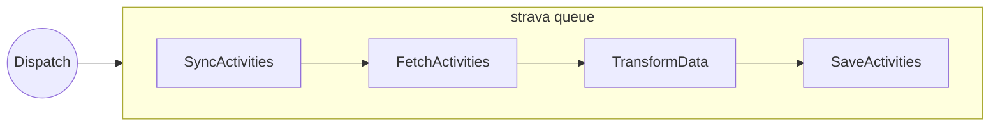
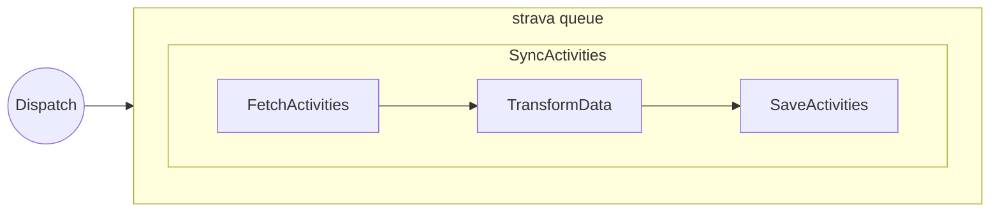
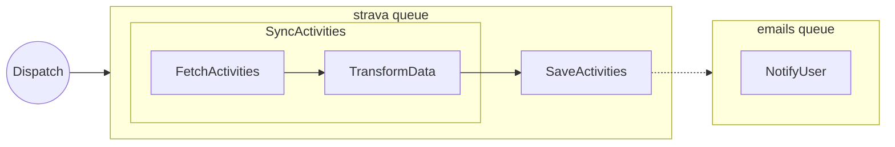

# Queues

Brain integrates with Laravel's queue system. Tasks and Processes can be dispatched to the queue by implementing `ShouldQueue`.

## Queueable Tasks

Implement `ShouldQueue` on your task:

```php
use Brain\Task;
use Illuminate\Contracts\Queue\ShouldQueue;

class SendWelcomeEmail extends Task implements ShouldQueue
{
    public function handle(): self
    {
        // runs on the queue
        return $this;
    }
}
```

## Delayed Execution

Use the `runIn()` method to delay a queued task:

```php
class SendFollowUp extends Task implements ShouldQueue
{
    protected function runIn(): int|Carbon|null
    {
        return now()->addDays(2);
    }

    public function handle(): self
    {
        // ...
        return $this;
    }
}
```

## Setting a Queue with `#[OnQueue]`

Use the `#[OnQueue]` attribute to assign a specific queue:

```php
use Brain\Attributes\OnQueue;
use Brain\Task;
use Illuminate\Contracts\Queue\ShouldQueue;

#[OnQueue('emails')]
class SendWelcomeEmail extends Task implements ShouldQueue
{
    public function handle(): self
    {
        return $this;
    }
}
```

::: danger
Do **not** declare `public string $queue = 'my-queue'` on a Task — this causes a PHP fatal error because Laravel's `Queueable` trait already declares `$queue` without a type hint. Always use `#[OnQueue]` instead.
:::

## Process-Level Queue

When `#[OnQueue]` is applied to a Process:

1. The Process itself is dispatched to that queue (if it implements `ShouldQueue`)
2. All queued child tasks **inherit** the Process queue — unless the task defines its own `#[OnQueue]`

```php
#[OnQueue('strava')]
class SyncActivities extends Process implements ShouldQueue
{
    protected array $tasks = [
        FetchActivities::class,   // ShouldQueue → runs on "strava" (inherited)
        SaveActivities::class,    // sync task → unaffected
        NotifyUser::class,        // #[OnQueue('emails')] → runs on "emails"
    ];
}
```

::: tip
A task's own `#[OnQueue]` always takes precedence over the process-level queue.
:::

## Execution Patterns

### All tasks on the same queue

The process and every queued task run on `strava`:



### Process queued, tasks synchronous

The process is queued, but tasks run synchronously inside the job:



### Mixed sync and queued

Some tasks run inside the process, others are dispatched to queues:


